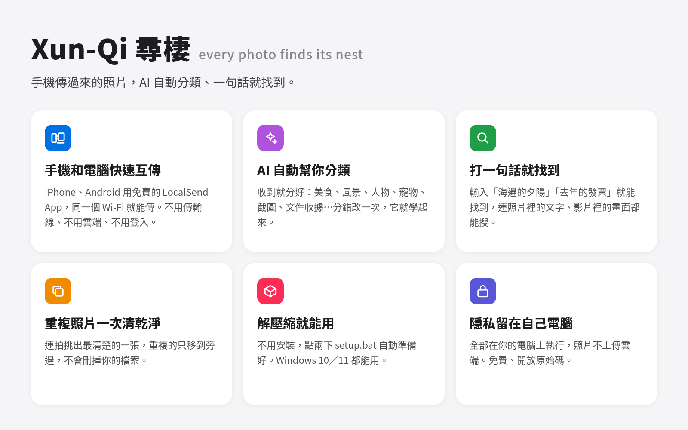
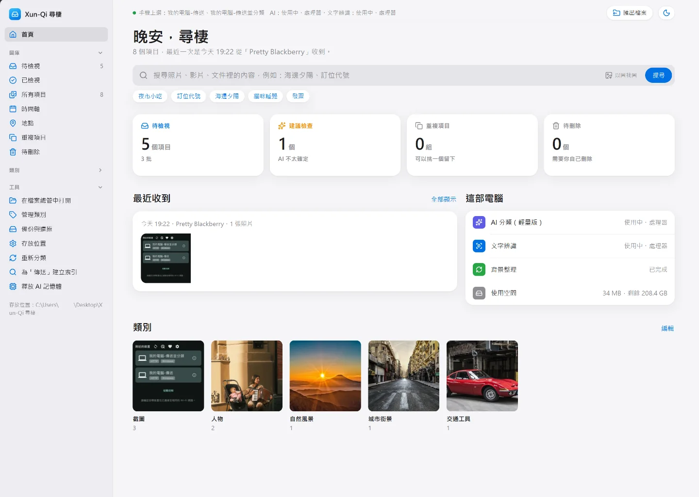
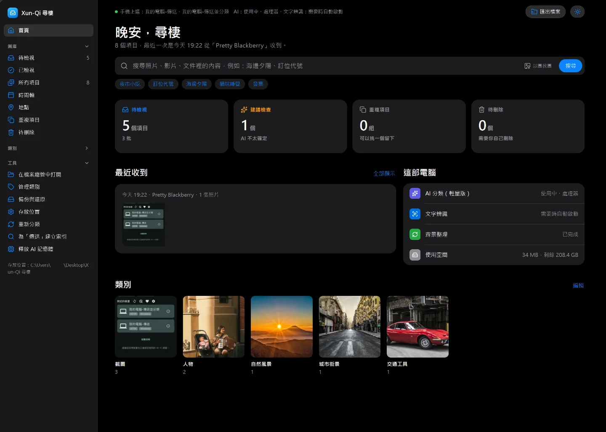
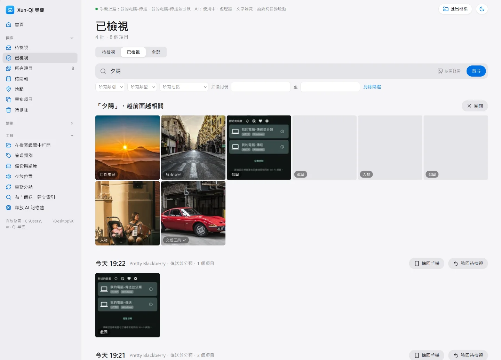
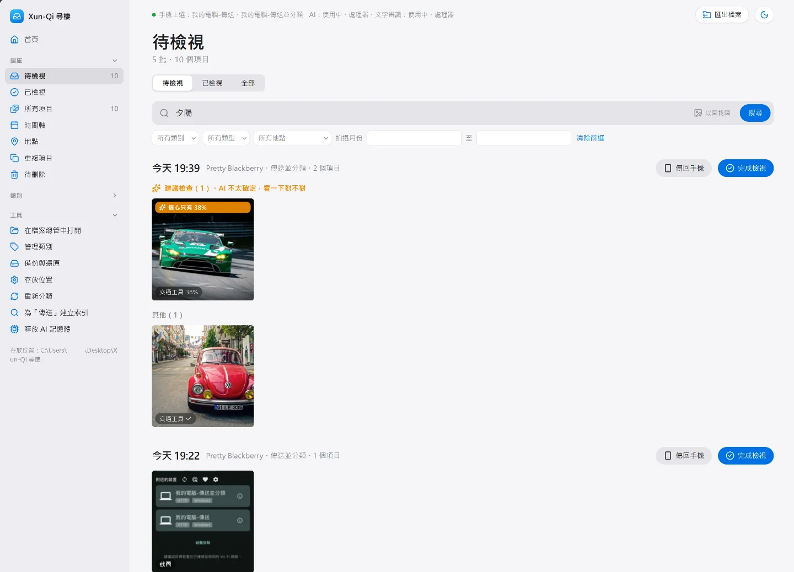
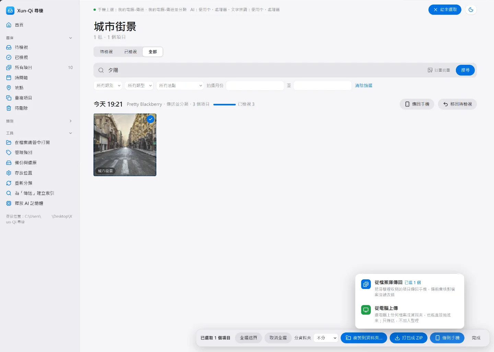
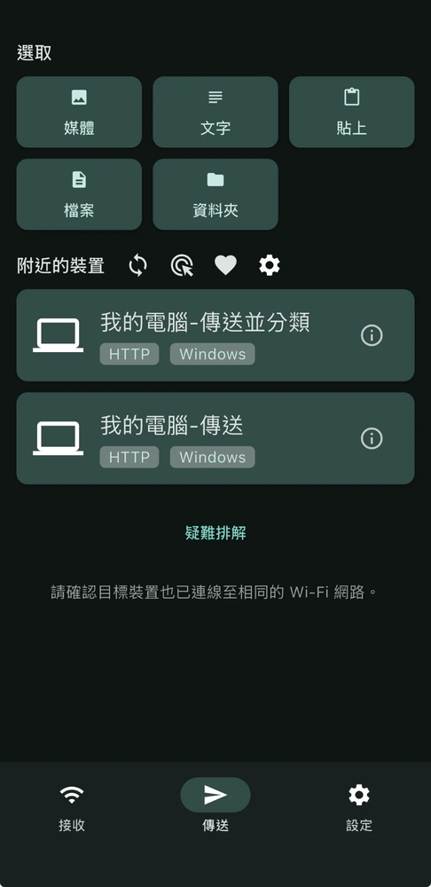

# Xun-Qi 尋棲

> every photo finds its nest

中文 | [English](README.en.md)

手機用 **LocalSend** App 傳照片、影片、文件到 Windows 電腦，尋棲會直接接收（相容 LocalSend 協定 v2），
用 Google 的 **EmbeddingGemma 2** 自動分類，之後可以用一句話搜尋、以圖找圖、找出重複檔。全部在你的電腦上執行，不上傳雲端。

本程式不是 LocalSend 官方產品。

## 畫面

| 首頁 | 深色模式 |
|---|---|
|  |  |

| 一句話搜尋 | 分批檢視 |
|---|---|
|  |  |

| 傳到手機 | 手機 LocalSend 選裝置 |
|---|---|
|  |  |

截圖中的範例照片來自 Pixabay（Pixabay Content License）。

## 功能
- 手機上看到兩台裝置：「傳送」只存檔，「傳送並分類」存完自動分類
- 每次傳送一批，可逐批檢視；檢查完整後提示「可以從手機刪除了」
- 一句話搜尋（中英文都可以）、照片裡的文字（OCR）、影片裡的某一秒
- 以圖找圖、連拍挑最清晰的、完全相同／很像的重複檔比較
- 自訂類別、GPS 地點、時間軸、匯出、索引備份與還原
- 傳到手機（「匯出檔案」→「傳到手機」）：
  - 從檔案庫傳回：把收到的項目（可整批）傳回手機，傳前核對檔案沒被改過
  - 從電腦上傳：電腦上任何檔案或資料夾，只傳送、不加入整理
- 介面語言：繁體中文／English（首次啟動依 Windows 語言自動選擇，可在「工具 › 語言」切換）
- 程式永遠不刪除你的檔案

## 三種版本
| 版本 | AI 模型 | 執行 | 文字辨識 | 影片 | 大小（約） |
|---|---|---|---|---|---|
| 輕量版 | ONNX int8 | DirectML 或 CPU | mobile | 每 6 秒 | 1GB |
| 標準版 | PyTorch 原始模型 | NVIDIA／Intel 顯示卡或 CPU | mobile | 每 4 秒 | 2–5GB |
| 旗艦版 | PyTorch 原始模型 | NVIDIA／Intel 顯示卡或 CPU | server | 每 2 秒 | 2–5GB |

## 安裝（免安裝，Windows 10/11 64 位元）
1. 解壓縮到任意資料夾（例如 `D:\XunQi`）
2. 執行 `setup.bat`，選擇版本
3. 執行 `download_model.bat`
4. 之後每次執行 `start.bat`，用瀏覽器開啟 `http://127.0.0.1:8765`

詳細說明見 `使用說明.txt`（English: `Guide.txt`）。

## 授權
程式碼：Apache License 2.0。第三方模型與資料見 `NOTICE`。
